<!-- ========================================== -->
<!-- HERO BANNER: THEME-AWARE DUAL SVG DISPLAY -->
<!-- ========================================== -->
<p align="center">
  <picture>
    <source media="(prefers-color-scheme: dark)" srcset="dark.svg">
    <source media="(prefers-color-scheme: light)" srcset="light.svg">
    
  </picture>
</p>

<p align="center">
  <a href="https://github.com/Rijvan26"></a>
  <a href="mailto:khanrijvan2610@gmail.com"></a>
  <a href="https://discord.gg/Rijvan26"></a>
  
  
</p>

---

## 👨‍💻 About Me

I am a **Full-Stack & MERN Developer** based in Indore, India, focused on engineering responsive web applications, secure RESTful APIs, and real-time systems. My work centers on building maintainable full-stack software from scratch—translating complex requirements into modular frontend components and clean backend architectures.

- 🔭 **Current Focus**: Architecting scalable MERN applications, integrating LLM reasoning engines (Google Gemini API), and building real-time collaboration features with Socket.IO.
- ⚡ **Engineering Principles**: Clean code, modular file architecture (MVC/DAO patterns), secure token-based authentication (JWT + HTTP-only cookies), and schema validation.
- 🛠️ **System Explorations**: Self-hosting private metasearch infrastructure (SearXNG with Docker), working with payment gateways (Razorpay SDK), and practicing Data Structures & Algorithms.
- 🎯 **Goal**: Contributing to high-impact product engineering teams as a full-stack or backend/frontend developer.

---

## 🛠️ Technical Competencies

### Core Stack (Production & Project Experience)
<table>
  <tr>
    <td width="20%"><strong>Frontend</strong></td>
    <td>
      
      
      
      
      
      
      
      
    </td>
  </tr>
  <tr>
    <td><strong>Backend &amp; APIs</strong></td>
    <td>
      
      
      
      
      
      
    </td>
  </tr>
  <tr>
    <td><strong>Database &amp; Storage</strong></td>
    <td>
      
      
      
      
    </td>
  </tr>
  <tr>
    <td><strong>DevOps &amp; Workflow</strong></td>
    <td>
      
      
      
      
      
      
    </td>
  </tr>
</table>

### Systems & Applied Learning
- **AI & Reasoning Integration**: Google Gemini API (`@google/genai`), LangChain (`@langchain/google`, `@langchain/mistralai`), Prompt Engineering, Zod schema validation.
- **Search Systems**: Self-hosted SearXNG metasearch engine configured via Docker, Tavily-style monorepo search wrapper.
- **Financial & Media Services**: Razorpay Payment Gateway integration (cryptographic verification, order generation), Multer file processing, ImageKit CDN storage.

---

## 🚀 Featured Engineering Projects

### 1. [Intellexx AI — Context-Aware AI Search Engine](https://github.com/Rijvan26/Baendshery)
> *A Perplexity-inspired full-stack application combining LLM reasoning with live web search retrieval.*
- **Core Stack**: React.js, Node.js, Express.js, MongoDB, Gemini API, Socket.IO, Tailwind CSS
- **Live Demo**: [perplexity-phi-mauve.vercel.app](https://perplexity-phi-mauve.vercel.app)
- **Key Engineering Implementation**:
  - Implemented real-time search synthesis that combines user query analysis, web data ingestion, and Gemini LLM generation.
  - Engineered secure JWT-based authentication featuring user registration, protected routes, and email verification via Nodemailer.
  - Built interactive conversational UI featuring markdown rendering, streaming status indicators, and persistent chat sessions in MongoDB.

### 2. [Buy Me a Coffee — Creator Support & Payment Gateway](https://github.com/Rijvan26/kodr4-backend)
> *A full-stack donation and supporter platform with end-to-end Razorpay payment processing.*
- **Core Stack**: React 19, TypeScript, Redux Toolkit, Node.js, Express 5, MongoDB, Razorpay SDK
- **Key Engineering Implementation**:
  - Structured full payment lifecycle: server-side order generation, client checkout modal handling, and cryptographic payment signature verification using HMAC-SHA256.
  - Built typed state management using Redux Toolkit and React Hook Form validation for reliable checkout workflows.
  - Configured cookie-based session verification with access and refresh token authentication guards.

### 3. [Snitch — Modular E-Commerce Platform](https://github.com/Rijvan26/kodr4-backend)
> *A full-stack e-commerce web platform engineered with clean catalog management and cloud media processing.*
- **Core Stack**: React 19, Redux Toolkit, Tailwind CSS v4, Node.js, Express 5, MongoDB, Multer, ImageKit
- **Key Engineering Implementation**:
  - Implemented cloud image upload pipeline combining Multer multipart form handling with ImageKit API storage.
  - Built product catalog schema with Mongoose, database seeding utilities, and category filtering.
  - Designed centralized shopping cart state flow using Redux Toolkit, persisting user selections and cart updates.

### 4. [SearXNG Metasearch Engine Service](https://github.com/Rijvan26/Dom-tasks-kodr)
> *A privacy-focused self-hosted search abstraction containerized in Docker for agent search pipelines.*
- **Core Stack**: SearXNG, Docker, TypeScript, Axios, pnpm Monorepo
- **Key Engineering Implementation**:
  - Configured a local SearXNG engine instance running inside Docker with custom engine weighting and JSON format output.
  - Developed a TypeScript API client abstracting multi-engine querying, domain filtering, and structured result extraction for AI consumption.

### 5. [Supervent — Interactive Event Discovery Platform](https://github.com/Rijvan26/Supervent)
> *Responsive web application for discovering, viewing, and organizing events.*
- **Core Stack**: JavaScript, React, CSS, Vercel
- **Live Demo**: [supervent.vercel.app](https://supervent.vercel.app)
- **Key Engineering Implementation**:
  - Developed responsive event filtering and layout components optimized for mobile and desktop screens.

---

## 🧩 Data Structures & Problem Solving

- **Primary Focus**: Practicing algorithmic problem solving and core Data Structures (Arrays, Strings, Hash Maps, Linked Lists, Recursion, Two Pointers, Stacks & Queues).
- **Core Languages**: Java and JavaScript.
- **Approach**: Focus on time and space complexity analysis ($O(n)$ analysis), memory efficiency, and handling edge cases systematically before writing implementation code.

---

## 📊 GitHub Analytics

<p align="center">
  
  
</p>

<p align="center">
  
</p>

---

## 📬 Connect & Collaborate

I am open to full-stack, frontend, or backend engineering opportunities, collaborative builds, and technical discussions.

- 💬 **Discord**: [discord.gg/Rijvan26](https://discord.gg/Rijvan26)
- 📧 **Direct Email**: [khanrijvan2610@gmail.com](mailto:khanrijvan2610@gmail.com)
- 🐙 **GitHub**: [github.com/Rijvan26](https://github.com/Rijvan26)
- 📍 **Location**: Indore, Madhya Pradesh, India

---

<details>
<summary>🐍 Optional: Setting Up GitHub Contribution Grid Snake</summary>

<br>

To generate the animated contribution grid snake for your profile without broken links, follow these steps:

1. Create the workflow file `.github/workflows/snake.yml`:
```yaml
name: Generate Contribution Snake

on:
  schedule:
    - cron: "0 0 * * *" # Runs daily at midnight
  workflow_dispatch:

permissions:
  contents: write

jobs:
  generate:
    runs-on: ubuntu-latest
    timeout-minutes: 10
    steps:
      - name: Generate Snake SVGs
        uses: Platane/snk@v3
        with:
          github_user_name: Rijvan26
          outputs: |
            dist/github-contribution-grid-snake.svg
            dist/github-contribution-grid-snake-dark.svg?palette=github-dark

      - name: Push to Output Branch
        uses: crazy-max/ghaction-github-pages@v3.1.0
        with:
          target_branch: output
          build_dir: dist
        env:
          GITHUB_TOKEN: ${{ secrets.GITHUB_TOKEN }}
```

2. Once the workflow has executed and created the `output` branch, you can reference the image in your README:
```html
<picture>
  <source media="(prefers-color-scheme: dark)" srcset="https://raw.githubusercontent.com/Rijvan26/Rijvan26/output/github-contribution-grid-snake-dark.svg">
  <source media="(prefers-color-scheme: light)" srcset="https://raw.githubusercontent.com/Rijvan26/Rijvan26/output/github-contribution-grid-snake.svg">
  
</picture>
```
</details>

<p align="center">
  <sub>Built with care &amp; clean code · © Rizwan Khan (Rijvan26)</sub>
</p>
